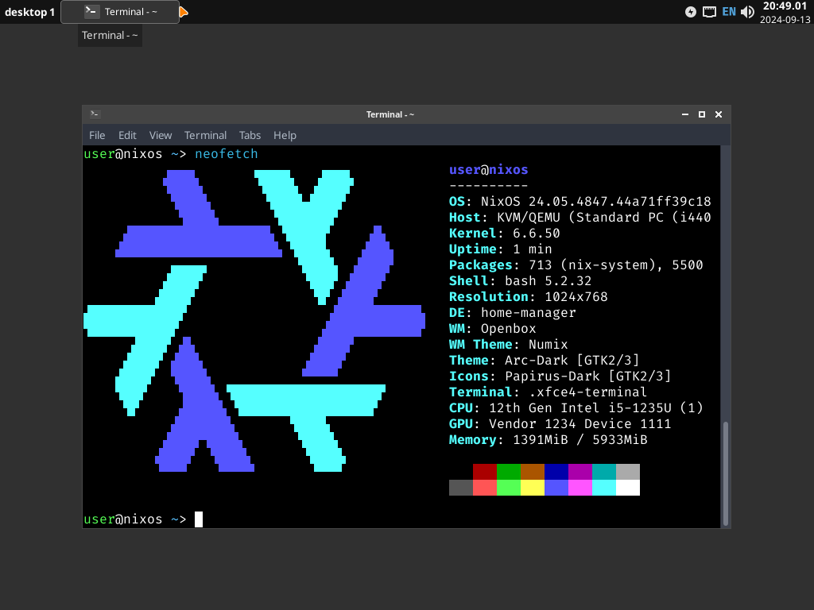

# NixOS Configuration
This is the collection of configuration files for my personal NixOS system.

### Screenshots
Current configuration without modification running under QEMU.  

### Features:
- Impermanence system managed by Home Manager;
- Customization via `persist.nix` which separates private and public configuration;
- Multiuser setup for isolating applications;
- Custom patches to applications for quality of life improvements;
